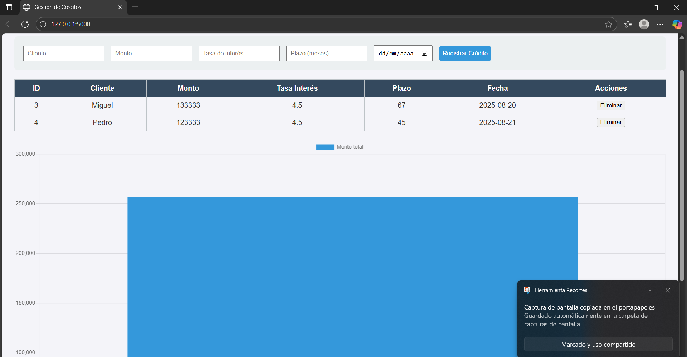

Gestor de Créditos con Python, Flask y SQLite

Aplicación web para registrar, listar, editar y eliminar créditos
Grafica 

Descripción:
Este proyecto permite gestionar créditos de clientes mediante un CRUD web

Parte de mi postulación

Características que contiene:

-Registrar nuevos créditos

-Editar créditos existentes

-Eliminar créditos

-Visualización de datos con gráfica del total de créditos

Material utilizado:

Python 3

Flask

SQLite3

HTML, CSS

Chart.js

Instalación y uso:

1. Clona el repositorio:

git clone https://github.com/TU-USUARIO/gestor-creditos-flask.git
cd gestor-creditos-flask

2. Crea un entorno virtual ya sea en MAC/LINUX O WINDOWS:

python -m venv venv
source venv/bin/activate   # Mac/Linux
venv\Scripts\activate      # Windows

3. Instala las dependencias:

pip install -r requirements.txt

4. Ejecuta la aplicación:

python main.py

5. Abre tu navegador en:

http://127.0.0.1:5000/

---Explicación del Código:---

creditos.py: Archivo principal que inicia la aplicación Flask y configura las rutas.

app/routes.py: Contiene todas las rutas de la API para el CRUD de créditos:

GET /api/creditos: Obtiene todos los créditos

POST /api/creditos: Registra un nuevo crédito

PUT /api/creditos/<id>: Edita un crédito existente

DELETE /api/creditos/<id>: Elimina un crédito

app/models.py:Es la que define la conexión con la base de datos SQLite y las funciones para interactuar con ella

templates/index.html: Es interfaz web, formulario para agregar créditos y tabla para listarlos.

static/style.css: Le da estilo a la pagina

Grafica: Se genera con Chart.js mostrando el total de créditos.

Flujo de funcionamiento:

El usuario agrega un crédito desde el formulario -> datos enviados al backend (Flask)

Flask guarda los datos en la base de datos SQLite

Los créditos se muestran en la tabla y se actualiza la gráfica automáticamente

-----NOTAS:----
Me costo un poco de trabajo realizarlo ya que algunas cosas son nuevas para mi, actualmente me meti algunos cursos pero sigo aprendiendo.

## Diagrama de Flujo

